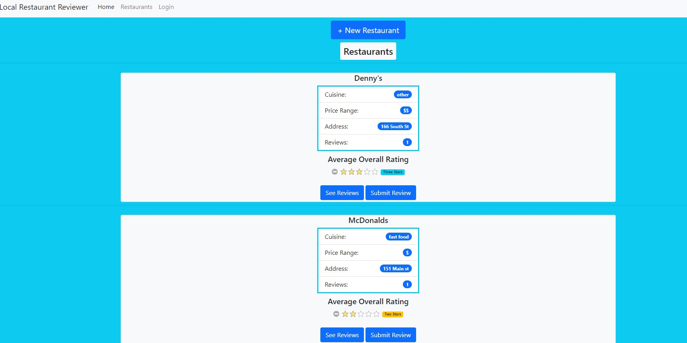

# Local Restaurant Reviewer

## Questions
* GitHub User Name: [ryanweiler92](https://github.com/ryanweiler92)
* Repository Link: [Local Restaurant Reviewer](https://github.com/ryanweiler92/Local-Restaurant-Reviewer)
* Application Link: [Local Restaurant Reviewer](https://mighty-harbor-87876.herokuapp.com/)
* For any additional questions please reach out to ryanweiler92@gmail.com.

## Description
This application allows users to rate and review local restaurants in their area. Users can also read reviews and edit their previous ratings on their own dashboard.

## Table of Contents
* [Installation](#installation)
* [Usage](#usage)
* [Contributors](#contributors)
* [Tests](#tests)
* [License](#license)

## Installation
No installation is required. 

## Usage

## Contributors
Ryan Weiler

## Tests 
No testing available at this time.

## License
  